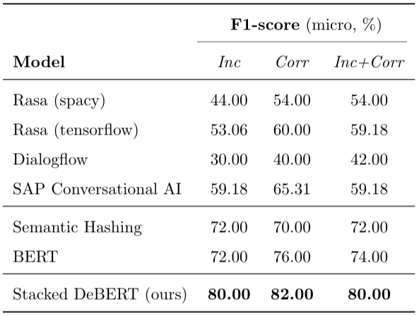
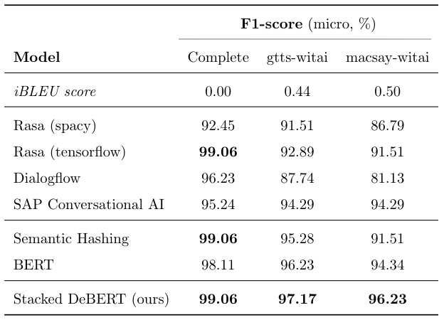

## About
Repository for paper titled [*""*](https://arxiv.org/abs/).

## Contents
[Overview](#overview) • [Requirements](#requirements) • [How to Use](#how-to-use) • [Results](#results) • [How to Cite](#acknowledgement)

## Overview
* Task: Text classification from noisy data
    * Twitter Sentiment Classification
    * Incomplete Intent Classification: text with STT error

* Model: Stacked Denoising BERT 
  > BERT + DeBERT (Denoising AutoEncoder + BERT)

* Baseline models
  * [BERT](https://github.com/huggingface/pytorch-pretrained-BERT)
  * NLU Platforms: [Rasa](https://rasa.com) (spacy and tf), [Dialogflow](https://dialogflow.com), and [SAP Conversational AI](https://cai.tools.sap) 
  * [Semantic Hashing with Classifier](https://github.com/kumar-shridhar/Know-Your-Intent)

## Requirements
Python 3.6 (3.7.3 tested), PyTorch 1.0.1.post2, CUDA 9.0 or 10.1
```
pip install -r requirements.txt
conda install pytorch torchvision cudatoolkit=9.0 -c pytorch
```

## How to Use
### 1. Dataset
* Chatbot NLU Evaluation Benchmark dataset with missing/incorrect data (STT errors) and Twitter Sentiment dataset (Check [Dataset README](./data/README.md))
* Training done on:
    * Twitter dataset: complete data, incomplete data, complete+incomplete data
    * Chatbot dataset: complete data, 2 TTS-STT data (gtts-witai, macsay-witai)

### 2. Pre-fine-tune BERT
* Twitter Sentiment Corpus
```
CUDA_VISIBLE_DEVICES=0,1 ./scripts/twitter_sentiment/run_bert_classifier_inc_with_corr.sh
```
> Script for *Inc+Corr* dataset. Scripts corresponding to *Inc* and *Corr* are also available in the same folder.

* Chatbot Incomplete Intent Corpus: texts with STT Error
```
CUDA_VISIBLE_DEVICES=0,1 ./scripts/stterror_intent/run_bert_classifier_stterror.sh
```
> Script for noisy data (*stterror*). Script for clean, non-noisy data, is also available (*complete*).

### 3. Train Stacked DeBERT
* Training on Twitter Corpus
```
CUDA_VISIBLE_DEVICES=0,1 ./scripts/twitter_sentiment/run_stacked_debert_dae_classifier_twitter_inc_with_corr.sh
```
> Make sure the OUTPUT directory is the same as the fine-tuned BERT or copy the BERT model to your new output dir.

* Training on NLU Evaluation Corpora for TTS=gtts/macsay and STT=witai and autoencoder epochs 100-1000.
```
CUDA_VISIBLE_DEVICES=0,1 ./scripts/stterror_intent/run_stacked_debert_dae_classifier_stterror.sh
```
> Make sure the OUTPUT directory is the same as the fine-tuned BERT or copy the BERT model to your new output dir.

## Results
* Twitter Sentiment Corpus
    <p align="left">
    
    </p>

* Chatbot Incomplete Intent Corpus: texts with STT Error
    <p align="left">
    
    </p>

## Acknowledgment
In case you wish to use this code, please use the following citation:

```
@misc{cunha2019stackeddebert,
   title={},
   author={},
   year={2019},
   eprint={1910.},
   archivePrefix={arXiv},
   primaryClass={cs.}
}
```
> Email for further requests or questions: `gwena.cs@gmail.com`

The authors would like to thank Snips.co for their public dataset ([Snips NLU Benchmark](https://github.com/snipsco/nlu-benchmark)), and HuggingFace's [BERT PyTorch code](https://github.com/huggingface/pytorch-pretrained-BERT).
