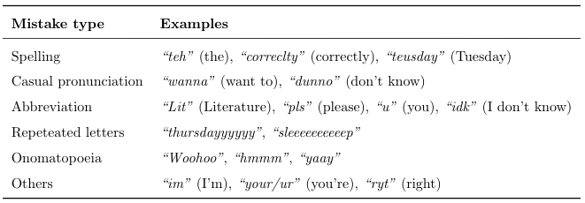

## Contents
[STT Error Data](#1-stt-error-dataset) • [Twitter Sentiment Data](#2-twitter-sentiment-dataset) • [Joint Comp/Inc](#3-joint-completeincomplete-data)

## Dependencies
Python 3.7.2, requests, numpy, nltk

## 1. STT Error Dataset
* Original datasets: [Snips NLU Corpus](https://github.com/snipsco/nlu-benchmark) and [Chatbot Corpus](https://github.com/sebischair/NLU-Evaluation-Corpora)

* Make STT Error Dataset: Text-to-Speech -> audio -> Speech-to-Text
```
cd make_stterror_data
python main.py --data_dir data/intent_[DATA_NAME]/
```
> DATA_NAME options = [snips, chatbot]

* Output:
    * TTS audios, STT recovered texts, BLEU scores
    * The `[DATA_NAME]_stt_error` directory was organized in such way to separate train and test in each TTS-STT combination
    
* Examples of sentences with STT error

    | Corpus | TTS    | BLEU score | Original | With STT error |
    | ------ | ------ | ---------- | -------- | -------------- |
    | Snips  | gtts   | 70.69      | "Play ep from Quasimoto from the nineties"      | *"play ep from the motor from the nineties."* |		
    | Snips  | macsay | 62.74      | "Play ep from Quasimoto from the nineties"      | *"play game of thrones night."* |
    | Chatbot| gtts   | 56.26      | "how can i get from garching to milbertshofen?" | *"how can i get from garching to melbourne open."* |
    | Chatbot| macsay | 49.58      | "how can i get from garching to milbertshofen?" | *"how can i get from garching to meal prep."* |
    > STT: Wit.ai

## 2. Twitter Sentiment Dataset
* Tweets have natural human error (noise)
    <p align="left">
    
    </p>
* Correct sentences are obtained with Amazon MTurk
    
* Examples of sentences with Natural Human error

    | Original | With Error |
    | -------- | ---------- |
    | "goonite  sweet dreamz" | "Good night, sweet dreams." |
    | "well i dunno..i didnt give him an ans yet" | "Well I don't know, I didn't give him an answer yet." |
    | "u kno who am i talkin bout??" | "Do you know who I am talking about?" |

## 3. Joint Complete/Incomplete Data
* In order for the model to be robust to missing data it also needs to be trained on sentences with missing words.
* After making the incomplete dataset, there are two options
   1. Make dataset with Complete and Incomplete Data
      ```
      python make_joint_comp_inc_data.py
      ```
   2. Make dataset with Incomplete Data (add target sentence to `tsv` file to train autoencoder)
      ```
      python add_target_to_inc_data.py
      ```